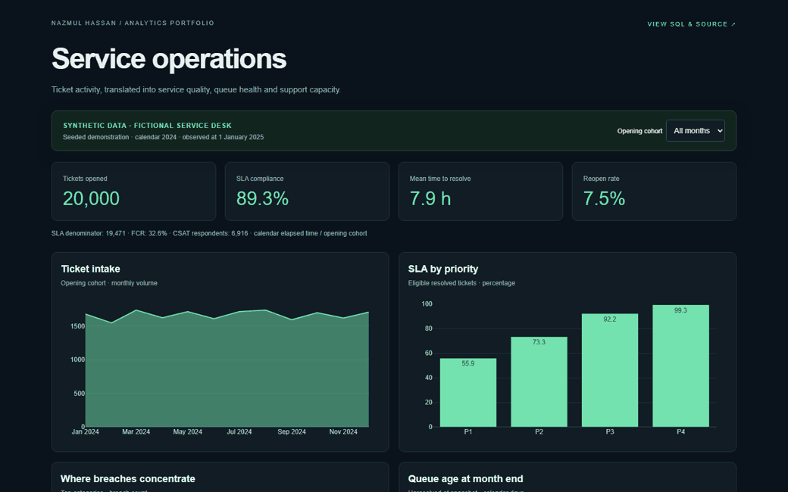
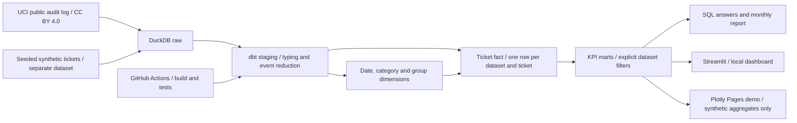
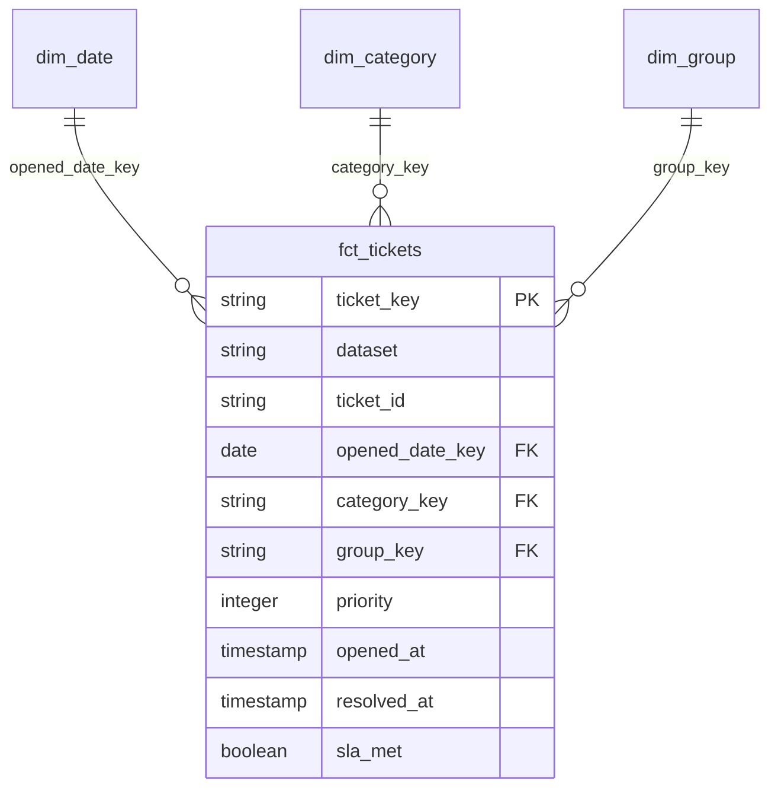
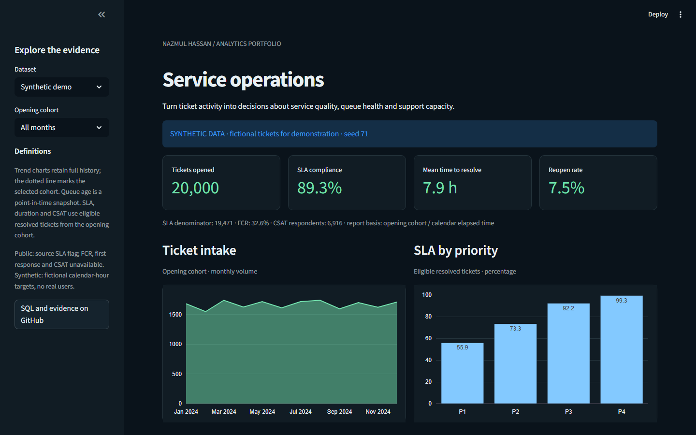
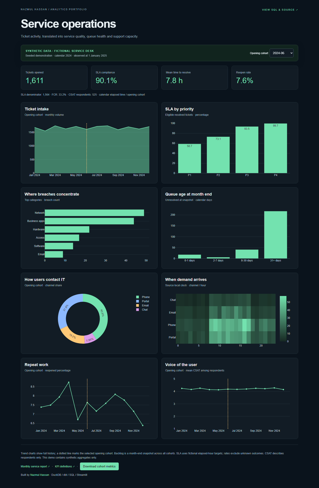

# Service Desk Analytics

Service desk activity turned into tested SQL models, clear KPIs and decisions an IT manager can act on.



[](https://github.com/iamnajib71/service-desk-analytics/actions/workflows/ci.yml)


[Live demo — synthetic data only](https://iamnajib71.github.io/service-desk-analytics/) · [Monthly report](docs/monthly-service-report.md) · [SQL findings](analysis/README.md)

## What it shows recruiters

- **Data / BI analyst:** SQL transformations, a ticket-grain star schema, dbt lineage and automated quality checks.
- **Reporting / business analyst:** defined denominators, stakeholder questions, reproducible findings and recommendations backed by output.
- **Service desk:** priority SLA monitoring, repeat-work review, queue ageing and demand patterns that inform support operations.

## Architecture





## Dashboard




The local Streamlit dashboard compares the public research data and the synthetic demonstration. The hosted dashboard serves only synthetic aggregates. The GIF records cohort changes, queue/demand charts and an evidence export from the working dashboard; see [demo recording notes](docs/demo.md).

## Quick start — Windows PowerShell

Install free [Python 3.12](https://www.python.org/downloads/) and Git. No Docker, paid account or credentials required. Run these commands from a new PowerShell window:

```powershell
git clone https://github.com/iamnajib71/service-desk-analytics.git
cd service-desk-analytics
powershell -NoProfile -ExecutionPolicy Bypass -File .\rebuild.ps1
.\.venv\Scripts\python.exe -m streamlit run dashboard/app.py
```

Open `http://localhost:8501`. The rebuild command downloads the licensed public archive, generates the seeded synthetic CSV, loads raw tables, builds **11 dbt models**, runs **38 dbt tests**, regenerates the SQL result tables/report/dashboard exports, and runs Python integration tests. Rerun it to reproduce everything. Internet is required for first-time packages and the data download. To use an existing Python executable: `rebuild.ps1 -Python C:\Path\To\Python312\python.exe`.

Linux/macOS or CI:

```bash
python3.12 -m venv .venv
.venv/bin/python -m pip install -r requirements.txt
.venv/bin/python scripts/build.py
.venv/bin/python -m streamlit run dashboard/app.py
```

## Results and evidence

Every figure below is generated by `scripts/evidence.py` from the rebuilt DuckDB warehouse. [Machine-readable evidence](docs/evidence.json) includes counts, denominators, date ranges and data-quality flags. Public observations and synthetic outcomes are intentionally separate.

| Evidence | Public UCI research data | Synthetic demonstration |
| --- | --- | --- |
| Ticket grain | 24,918 unique incidents from 141,712 audit rows | 20,000 fictional tickets |
| SLA compliance | 61.78% / 23,362 eligible resolved tickets | 89.29% / 19,471 eligible resolved tickets |
| Mean elapsed time to resolve | 178.17 h | 7.94 h |
| Tickets reopened | 1.10% of all opened tickets | 7.50% of all opened tickets |
| First contact resolution | Unavailable in source | 32.55% of known resolved-ticket flags |
| CSAT | Unavailable in source | 4.20 / 5 from 6,916 responses |
| Quality checks | 38 dbt tests across both datasets | Chronology, validity, keys, reconciliation and missing-metric checks |

### Business questions and findings

Five parameterised SQL queries answer: where breaches concentrate; whether the mean hides a slow resolution tail; who owns aged queue items; which contact channel/hours drive intake; and which categories generate repeat work. Each has a CSV result and a two-line plain-English interpretation for both datasets in [analysis/results](analysis/results).

- **Public breach hotspot:** Category 40 in 2016-03 recorded 214 breaches from 259 eligible tickets (82.63%). Review that cohort before attributing a cause.
- **Public resolution tail:** Category 34 had a 1,326.32-hour mean versus a 404.72-hour median and 4,098.32-hour 90th percentile. A mean-only dashboard would conceal the tail.
- **Synthetic operational response:** the [monthly service report](docs/monthly-service-report.md) turns the December cohort into recommendations about Network breach reviews, aged queue ownership and closure checks.

### KPI definitions

Opening cohorts underpin outcome trends. SLA = compliant / known resolved outcomes; MTTR = mean valid opened-to-resolved elapsed hours; reopen rate = tickets reopened at least once / intake. Backlog is a point-in-time count across all opening cohorts, with mutually exclusive calendar-day age buckets. FCR uses an explicit flag, and CSAT averages respondents only. Full denominators, source-specific rules and limits: [measurement contract](docs/kpi-definitions.md).

## Project structure

```text
data/SOURCE.md             source, licence, download date and data rules
scripts/                  seeded generation, ingestion, build and evidence export
dbt/models/staging/       typed and deduplicated source records
dbt/models/marts/         ticket star schema and KPI marts
dbt/tests/                custom business-rule and reconciliation tests
analysis/                 five SQL questions, CSV results and findings
dashboard/                Streamlit app, shared Plotly charts and exported data
site/                     synthetic-only static live demo
docs/                     report, screenshots, demo and verified evidence
tests/                    generator, boundary and dashboard integration tests
.github/workflows/        build/test CI and Pages deployment
```

## Honest limits

This is a portfolio project, not a production service or a claim about a Melbourne employer. The primary dataset is public anonymised historical research data licensed CC BY 4.0; project code is MIT. Synthetic data is separately labelled everywhere it is shown. [Provenance](data/SOURCE.md) records the source archive hash and transformation rules.

Public data has no CSAT, reliable response timestamp or verified FCR. Anonymous category IDs are not translated into invented service names. Source timestamps have no stated timezone. The latest audit row determines classification; retrospective backlog uses final timestamps/group and cannot reconstruct all transfers or reopen intervals. Invalid timestamps are flagged and excluded from outcomes, possibly overstating backlog. Outcome rates exclude unresolved tickets and are subject to observation-age bias. Synthetic SLA targets are fictional calendar-hour rules, not industry benchmarks. Descriptive correlations do not establish causes. No Power BI file is claimed.

**Built by Nazmul Hassan** · [LinkedIn](https://linkedin.com/in/iamnajib71) · [GitHub](https://github.com/iamnajib71)
